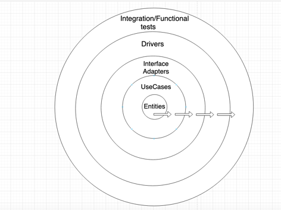

# Note : 
Please refer "multi-module-approach" branch for same code reference developed in maven multi module approach

# Customer Loan service :
Consider below is the business use case shared by a business team on which this sample application is built :
1. Receive request to create a new Loan (car/housing)
2. Check if customer is fraud or not
3. if fraud, don't create a new loan, respond with error
4. if not fraud, create a new Loan
5. Save the loan to DataStore
6. Respond with Loan information

# Clean Architecture :


# Package structure reflecting Clean Architecture layers :


# What does each layer mean :

1. **_Entities_** - The place where our enterprise business rules resides (_NOT a layer with just plain old java object having getters & setters - rather the actual behaviours/functions is encapsulated, if following DDD this is the place where the domain concepts resides_)
2. **_UseCases_** - The place where our application business rules resides, which controls the dance of Entities
3. **_InterfaceAdapters_** - The place where implementation for database, http call , interfaces defined in UseCase resides
4. **_Drivers_** - The place where all the independent components are stitched together to form an application (web)

## Boundaries :

```text
    Clear boundaries defined :
    - Entities doesn't know anything about its outer circles  (i.e UseCases, InterfaceAdapters, configurations layer).
    - UseCases doesn't know anything about its outer circles  (i.e InterfaceAdapters, configurations layer), but knows about its inner circles (i.e Entities)
    - InterfaceAdapters doesn't know anything about its outer circles (i.e Drivers), but knows about its inner circles (i.e Entities, UseCases layer)
    - Drivers knows about its inner circles (i.e InterfaceAdapters, Entities, UseCases layer)
```

## Test segregations :

1. **_Entities_** - pure domain related tests - Restrict for unit tests (mock the dependencies if any) 
2. **_UseCases_** - pure domain related tests - Restrict for unit tests (mock the dependencies if any)
3. **_InterfaceAdapters_** -
   1. high level business use case tests - Includes the integrated functional tests here
   2. high level technical tests - Includes the tests of database/rest integration, retries, timeout etc.
4. **_Drivers_** - A simple test to check if application comes up properly by stitching all the layers together


# Why Clean Architecture :

1. _**Entities & UseCases layers are central and every other layers support  them**_ - which means our application is purely driven by business aspects and not from technical perspective
2. **_Easy maintenance_**  -
    1. Separation of concerns of,
        1. business vs technical
        2. framework dependent vs framework in-dependent
3. **_Refactor friendly_** - Easy to refactor applications (consider scenarios of getting rid of frameworks like reactor/springboot, and this can be done without affecting the domain layers )
4. **_Independent of external interactions_** - Changes in the external http contract or database doesn't affect the Entities & UseCases (unless its required to update the domain with business logics)
5. **_Evolving architecture_** -
    1. Domain is evolved free from the external dependencies
    2. The rate at which the entity/usecases evolve (more frequent ?) as compared to interfaceadapters/drivers (less frequent ?) are totally different.

# How does a typical development happens ?
    
Development flow :



# AppMap :


# Note:
This application is used for demo purpose, hence exhaustive test cases/exception handling etc are not covered in the applications.

# References :
https://www.oreilly.com/library/view/clean-architecture-a/9780134494272/
