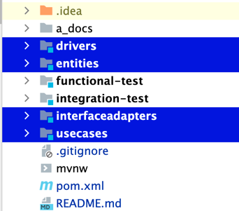
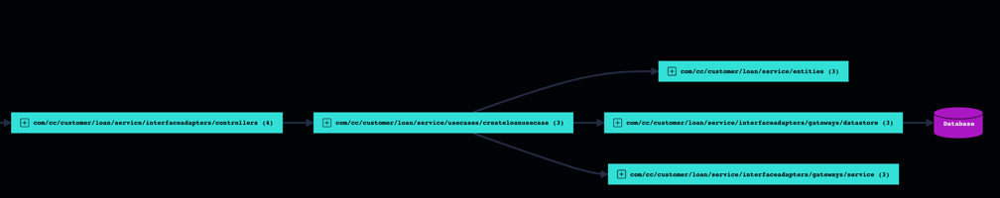
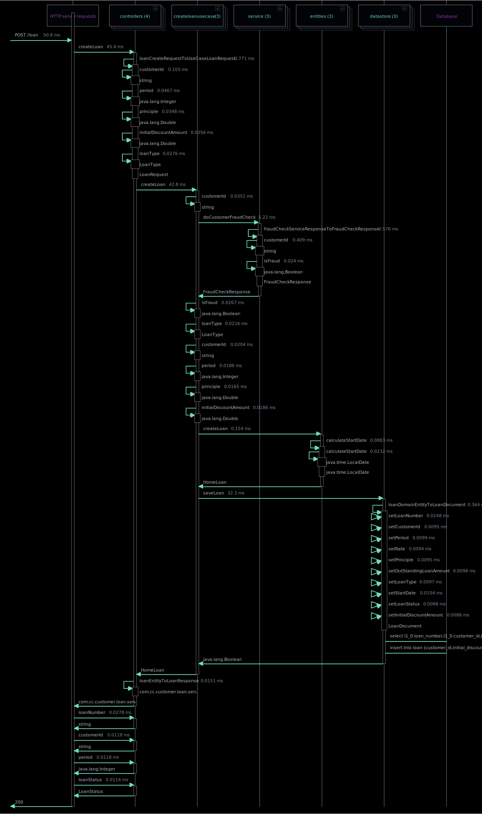

# Customer Loan service :
Consider below is the business use case shared by a business team on which this sample application is built :
1. Receive request to create a new Loan (car/housing)
2. Check if customer is fraud or not
3. if fraud, don't create a new loan, respond with error
4. if not fraud, create a new Loan
5. Save the loan to DataStore
6. Respond with Loan information

# Clean Architecture :

# What does each layer mean :

1. **_Entities_** - The place where our enterprise business rules resides | Core java - framework independent
2. **_UseCases_** - The place where our application business rules resides, which controls the dance of Entities |  Core java - framework independent
3. **_InterfaceAdapters_** - The place where implementation for interfaces of UseCase, database, http call resides | framework dependent
4. **_Drivers_** - The place where all the independent components are stitched together to form an application (web) | framework dependent
5. **_Functional-tests_** - The place where all high-level functional(business use cases) integration tests reside
5. **_Integration-tests_** - The place where all technical (database/rest integration, retries, timeout etc.) integration tests reside

    Clear boundaries defined :
    - Entities doesn't know anything about its outer cirlces  (i.e UseCases, InterfaceAdapters, configurations layer).
    - UseCases doesn't know anything about its outer circles  (i.e InterfaceAdapters, configurations layer), but knows about its inner circles (i.e Entities)
    - InterfaceAdapters doesn't know anything about its outer circles (i.e Drivers), but knows about its inner circles (i.e Entities, UseCases layer)
    - Drivers doesn't know anything about Functional-test/Integration-test, but knows about its inner circles (i.e InterfaceAdapters, Entities, UseCases layer)
    - Functional-tests know every layer
    - Integration-tests know every layer

# Package structure reflecting Clean Architecture layers :

# Why Clean Architecture :

1. _**Entities & UseCases layers are central and every other layers support  them**_ - which means our application is purely driven by business aspects and not from technical perspective
2. **_Separation of concerns_**  - business vs technical concerns, framework vs non-framework modules, easy vs hard to maintain modules
3. **_Independent of Database_** - easily swap the database (like sql, nosql etc) without affecting the Entities & UseCases
3. **_Independent of Database_** - easily swap the database (like sql, nosql etc) without affecting the Entities & UseCases
4. **_Independent of external interactions_** - Changes in the external http contract doesn't affect the Entities & UseCases (unless its required to update the domain with business logics) 

# AppMap :

# Note:
This application is used for demo purpose, hence exhaustive test cases/exception handling etc are not covered in the applications.

# References :
https://www.oreilly.com/library/view/clean-architecture-a/9780134494272/